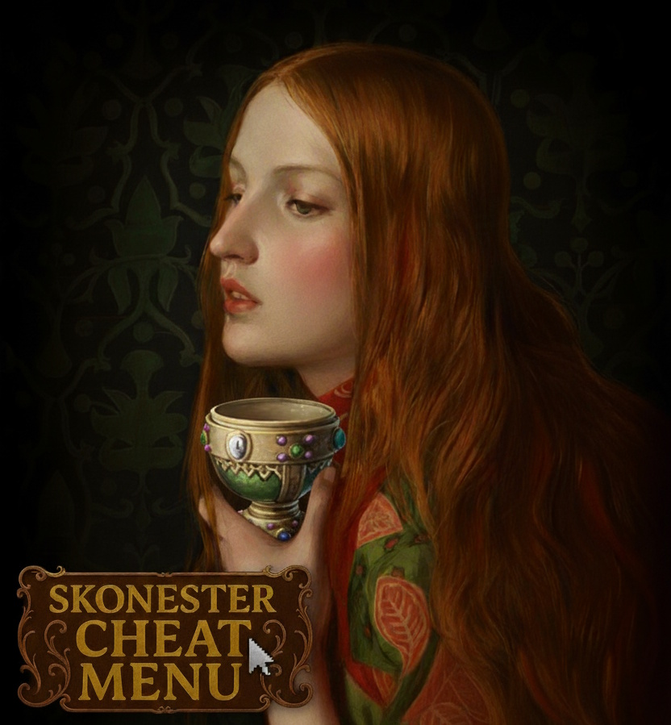

# Skonester Cheat Menu

  

## Table of Contents
- [Background & Vision](#background--vision)
- [Master Feature List](#master-feature-list)
  - [The "Paragon" Traits Suite](#the-paragon-traits-suite)
  - [The Modifier Menu Customizer](#the-modifier-menu-customizer)
  - [Character Interaction Menu (Forbidden Powers)](#character-interaction-menu-forbidden-powers)
  - [Resource & Dynasty Management](#resource--dynasty-management)
  - [Warfare, Armies & Instant Conquest](#warfare-armies--instant-conquest)
  - [Ultimate Building & Development Decisions](#ultimate-building--development-decisions)
  - [Government & Succession Law Manipulation](#government--succession-law-manipulation)
  - [The Great Heir Spawning System](#the-great-heir-spawning-system)
  - [Religion, Culture & Tradition Mastery](#religion-culture--tradition-mastery)
  - [Legendary Artifacts & Relics Library](#legendary-artifacts--relics-library)
  - [Health, Immortality & Genetic Purity](#health-immortality--genetic-purity)
- [Translation & Localized Support](#translation--localized-support)
  - [The Consolidated Rebuilder Tool](#the-consolidated-rebuilder-tool)
- [Installation Guide](#installation-guide)
- [Comprehensive Changelog](#comprehensive-changelog)
- [Contributing & Community](#contributing--community)
- [License & Credits](#license--credits)

---

## Background & Vision

The **Skonester Cheat Menu** is the definitive evolution of the legendary *Daddy Pika's Cheat Menu*. Originally built for earlier versions of Crusader Kings III, this fork was born from a necessity to fix crashes and compatibility issues with the *Roads to Power* (v1.13+) update and beyond. 

Our vision is to provide a "God Mode" experience that is both deep and accessible. Whether you want to roleplay as an immortal god-king, stabilize a crumbling empire, or experiment with the game's deepest mechanics without the grind, this mod provides the tools to do so through a seamless graphical interface.

---

## Master Feature List

### The "Paragon" Traits Suite
The mod introduces several powerful traits that provide staggering bonuses, effectively turning a character into a superhuman entity:
*   **Paragon** (`trait_super`):
    *   **Attributes**: +100 to Diplomacy, Martial, Stewardship, Intrigue, Learning, and Prowess.
    *   **Resources**: +30 Monthly Prestige, +1000 Monthly Piety, +1000 Monthly Income.
    *   **Social**: +1000 Attraction Opinion, +500% Fertility, +100 Years of Fertility.
    *   **Schemes**: 10x Hostile/Personal Scheme Power, +100 flat power to all scheme types.
    *   **Realm**: +200 Vassal Limit, +200 Domain Limit, ignores negative culture opinion.
    *   **Genetics**: 100% chance to strengthen genetic traits, -100% inbreeding chance.
*   **Steward of Wonders** (`trait_super_governor`): 
    *   **Development**: +1000% Development Growth.
    *   **Construction**: -1000% Build Speed (Instant) and -100% Build Cost (Free).
    *   **Control**: +100 Monthly County Control growth.
    *   **Public Image**: +100 County Opinion.
*   **Warlord Anointed** (`trait_super_general`): 
    *   **Combat**: +100 Advantage, +20 Min Combat Roll, +40 Max Combat Roll.
    *   **Movement**: 10x Movement Speed, 10x Naval Movement Speed.
    *   **Siege**: -1000% Siege Phase Time (Instant Sieges).
    *   **Logistics**: No water crossing penalties, -100% Hostile County Attrition, 10x Supply Capacity.

### The Modifier Menu Customizer
A deep, togglable system that allows you to fine-tune your character's bonuses. You can enable modifiers that scale with your **Prestige Level** or **Piety Level**:
*   **Scaling Stats**: Diplomacy/Martial/Stewardship/Intrigue/Learning/Prowess per level of Fame/Devotion.
*   **Opinion Toggles**: Specific opinion bonuses for every category: Same/Different Faith, Same/Different Culture, Liege/Vassal, Clergy, Powerful Vassals, Courtiers, Guests, Prisoners, and even specific family members like Twins or Player Heirs.
*   **Economic Toggles**: Toggles for Tax Multipliers, Domain Tax (even if a baron), and Stress-based income.

### Character Interaction Menu (Forbidden Powers)
Right-click any character to access the **Skonester Cheat Menu** interaction category. This provides direct control over individual souls:
*   **Life and Death**:
    *   **Murder / Kill Personally**: Instantly end a character's life by your own hand.
    *   **Grant Death / Natural Death**: Arrange for a character to pass away peacefully.
    *   **Annihilate Dynasty / Complete Annihilation**: Hunt down and extinguish an entire bloodline until none remain.
    *   **Take One’s Own Life**: Force a character to choose suicide.
*   **Social & Family Manipulation**:
    *   **Sleep Together**: Instantly initiate a tryst.
    *   **Impregnate**: Quicken a womb by command.
    *   **Force Marriage / Force Betrothal**: Bind souls in wedlock regardless of their will.
    *   **Adopt This Person / Disown**: Bring someone into your family or cast them out.
    *   **Join Your Dynasty**: Adopt a soul directly into your noble bloodline.
    *   **Designate Heir**: Proclaim a rightful inheritor to your legacy.
    *   **Add Concubine**: Take a soul into your household.
    *   **Divorce**: Instantly dissolve matrimonial bonds.
*   **Political & Legal Control**:
    *   **Modify Contract**: Rewrite vassal oaths of fealty without consequence.
    *   **Force Vassal**: Bend any soul to your rule.
    *   **Imprison**: Cast a soul into chains.
    *   **Excommunicate / Remove Excommunication**: Control a character's standing with the holy church.
    *   **Switch Character**: Forsake your current path and walk in the stead of another.
*   **Spiritual & Cultural Shift**:
    *   **Change Religion / Change Culture**: Bend a spirit to new faiths or customs.
*   **Knowledge & Power**:
    *   **Super Boost**: Bless a character with extraordinary ability.
    *   **Gain Secrets**: Uncover every hidden whisper and shadow.
    *   **Join Court**: Summon any person into your halls.

### Resource & Dynasty Management
*   **Treasure of the Realm**: Instantly add **100,000 Gold, Prestige, Piety**, and **100,000 Dynasty Renown**.
*   **Currency Menu**: A specialized interface to bestow wealth, honor, and renown.
*   **Dynasty/House Wide Cheats**: Toggle auto-marriage and eugenics for your entire noble house.

### Warfare, Armies & Instant Conquest
*   **Army Menu**:
    *   **House Guards**: Spawn 10 stacks of elite, inheritable Men-at-Arms.
    *   **House Cavalry**: Spawn 10 stacks of elite heavy cavalry.
    *   **Conqueror Armies**: Summon massive event troops for grand expansion.
*   **Territorial Interaction**:
    *   **Claim Their Title / Usurp Title**: Lay claim to or instantly seize another's lordship.
    *   **Revoke Title**: Strip a soul of their honor and holdings.
    *   **Unrestricted Warfare**: Bypass standard Casus Belli requirements.
    *   **Become Conqueror**: Apply the 'Conqueror' trait and multiple legendary historical traits.

### Ultimate Building & Development Decisions
The mod includes a specialized sub-menu ("The Gnostic Craft") for realm development:
*   **Raise All Holdings to Their Full Glory**: A single decision that upgrades every building in your sub-realm to its absolute maximum level.
*   **The Blessed Seven Works**: Mass-upgrades every worthy structure across your holdings.
*   **Grant New Grounds for Building**: Adds building slots to your domains, allowing up to seven structures per barony.
*   **Maximize Development / Maximize Control**: Raise the order and prosperity of your lands to their utmost heights via the **Realm Menu**.

### Government & Succession Law Manipulation
Total control over the laws of your realm:
*   **Government Menu**:
    *   Instantly change to **Tribal, Clan, Feudal, Administrative, Nomadic**, or **Adventurer** governments.
    *   Specialized types: **Celestial** (Imperial Chinese), **Meritocratic**, **Mandala**, **Wanua**, or **Japanese Administrative/Feudal**.
*   **Succession Law Manipulation**:
    *   **Change Succession**: Instantly switch between **Primogeniture, Ultimogeniture**, or **House Seniority**.
    *   **Realm Succession**: Detailed control over **Confederate Partition, Partition**, or **High Partition**.
    *   **Gender Succession**: Set the law to **Male Only, Male Preference, Equal, Female Preference**, or **Female Only** for yourself and your vassals.

### The Great Heir Spawning System
Need a perfect successor? Use the **Character Spawner**:
*   **Great Heir**: Spawns a child with level 3 Beauty, Intellect, and Physique traits, +15 to all base stats, and 10 base health.
*   **Bulk Spawning**: Options to spawn 1, 2, 5, or 10 heirs (male or female) at once.

### Religion, Culture & Tradition Mastery
*   **Edict of Culture & Edict of Faith**: One-click decisions to convert your entire sub-realm (counties, vassals, family) to your current Culture or Faith.
*   **Convert Vassals**: Compel all vassals to follow your spiritual and cultural path.
*   **The Tradition Vault**: A decision that applies nearly **100 powerful cultural traditions** simultaneously.

### Legendary Artifacts & Relics Library
Instantly populate your court with the most famous relics in history:
*   **Historical Relics**: Ark of the Covenant, Excalibur, Durendal, Joyeuse, Holy Grail, Stone of Scone, Throne of Charlemagne, and many more.
*   **Cheat Equipment**: High-tier custom-coded weapons, armor, crowns, and regalia.
*   **Legendary Books**: Spawn forbidden tomes (Caligula, Lady Godiva, Sinbad).

### Health, Immortality & Genetic Purity
*   **Panacea of the Realm**: A decision that cures every disease (Plague, Consumption, Cancer, etc.) and physical wounds.
*   **Purging of Afflictions**: Banishes carnal maladies and common ailments from the realm.
*   **Purification of Bloodlines**: Removes negative genetic traits like Inbred, Clubfooted, and Hunchbacked.
*   **Immortal**: Toggle the trait to lock a character's age at 25 and prevent natural death.

---

## Translation & Localized Support

To make translating the mod easier for our international community, we have provided a **Consolidated Localization File**. Instead of hunting through dozens of separate `.yml` files, you can find every single text string used by the mod in one place.

### How to use the Consolidated File:
1.  Navigate to the `data_binding/` folder in the mod root.
2.  Locate `fully_consolidated_l_english.yml`.
3.  **To Create a New Translation**:
    *   Copy the file and rename it according to your target language (e.g., `fully_consolidated_l_french.yml`).
    *   Open the file in a text editor (VS Code or Notepad++ recommended).
    *   Change the first line from `l_english:` to your target language code (e.g., `l_french:`).
    *   Translate the text inside the quotation marks for each key.
4.  Once finished, place your translated file in the `localization/[language]/` folder of your mod or submit it via a Pull Request on Github!

### The Consolidated Rebuilder Tool
For modders and translators who want to ensure the consolidated file is perfectly up-to-date with the latest mod version, we include a Python utility in the `data_binding/` folder:

*   **rebuild_loc_mod1.py**: A Python script that scans the entire `localization/english/` directory and merges all keys into the single consolidated file. It automatically handles UTF-8 BOM encoding required by the game.
*   **rebuild_localization.bat**: A user-friendly Windows batch file. Simply **double-click** this file to run the rebuilder without needing to open a command prompt. (Requires Python 3 installed on your system).

---

## Installation Guide

1.  **Download**: Unpack the mod archive.
2.  **Locate Mod Folder**: Place the contents into your CK3 mod directory (usually `Documents/Paradox Interactive/Crusader Kings III/mod/`).
3.  **Launcher Setup**: Open the Paradox Launcher, create/edit a playset, and ensure "Skonester Cheat Menu" is enabled.
4.  **Load Order**: Generally, this mod should be placed towards the bottom of your load order to ensure its interactions and decisions take priority.

---

## Comprehensive Changelog

### 2026 Updates

**April**
* **Taurus V 1.2**: Bug cleanup code from 1.18
* **Taurus V 1.1**: Added extensive character religion/culture editing interactions. Updated for game version 1.19.0.4 (Scribe).
* **Aries V 1.2**: Secondary update for Scribe compatibility. Expanded the 'Special Gifts' interaction menu.

**March**
* **Aries V 1.1**: Initial update for the Scribe patch.
* **Pisces V 1.4-Beta**: First official Github release.
* **Pisces V 1.3**: Consolidated menu decisions and cleaned up logic to prevent UI clutter.

**February**
* **Pisces V 1.2**: Added Religious Tenant unlocking decisions. Fixed maximum scheme limitations.
* **Pisces V 1.1**: The "Pisces Proper" main release.
* **Pisces V1**: Added Advanced Search and Culture-specific cheat decisions.

**January**
* **Aquarius V 1.2**: Added more Feudal Elective law options and succession fixes.
* **Aquarius V 1.1**: Expanded the trait library and cleaned up localization.
* **Aquarius V1**: Full update for version 1.18.3. Added 'Lore' section to the character menu and new Duchy building cheats.
* **Capricorn V1**: Introduced the 'Quick Modification Menu'.

### 2025 Updates

**November - December**
* **Sagittarius V1**: Fixed government transition issues. Added interactions from recent DLCs.
* **Scorpio V5**: Final optimization pass for the 2025 release cycle.
* **Scorpio V4**: Full 1.18.0.2 compatibility. Added more Debug-level interactions.

**October**
* **Scorpio V2**: Added compatibility for Meritocratic, Mandala, and Wanua government types. Added 'Treasury' options to the Currency Menu.
* **Scorpio V1**: Initial 1.18.0 compatibility check.

**August - September**
* **Virgo V3-V5**: Cosmetic overhaul. Redesigned all menu icons and background illustrations. Fixed the 'Anointed by Barbara' bug for female characters.
* **Leo V1-V2**: Total codebase overhaul for compatibility with version 1.16+; transitioned away from the legacy Daddy Pika structure for better performance.

---

## Contributing & Community

This project is open-source and community-driven. 
*   **Feedback**: We welcome reports on missing localizations or bugged interactions.
*   **Contributions**: Pull requests for new translations (especially Turkish, Chinese, and Spanish) are highly appreciated.
*   **Support**: I do not accept donations. If you enjoy the mod, please support the creators of the larger total conversion mods (EK2, AGOT, etc.) that make the CK3 community so vibrant.

---

## License & Credits

### Credits
The **Skonester Cheat Menu** is a community-driven project that builds upon the foundations laid by the giants of the CK3 modding scene. This mod is an evolution and continuation of the following works:
*   **DaddyPika**: Original creator of the *Daddy Pika's Cheat Menu*.
*   **Zhuge**: Major contributor to the advanced character interactions and menu logic.
*   **Community Contributors**: Special thanks to Pavel, Bone, Leech, Sol, Xorxidox, Gravity, and x4077 for various scripts and assets used in this version.

### License
This mod is released under the **Creative Commons Attribution 4.0 International (CC BY 4.0)** license.

Under this license, you are free to:
*   **Share**: Copy and redistribute the material in any medium or format.
*   **Adapt**: Remix, transform, and build upon the material for any purpose, even commercially.

**Under the following terms:**
*   **Attribution**: You must give appropriate credit, provide a link to the license, and indicate if changes were made. You may do so in any reasonable manner, but not in any way that suggests the licensor endorses you or your use.
*   **Evolutionary Notice**: As this mod is an evolution of work by **DaddyPika** and **Zhuge**, any derivative works must also maintain clear attribution to the original creators and the Skonester development team.

For full license details, please visit: [Creative Commons CC BY 4.0](https://creativecommons.org/licenses/by/4.0/)
