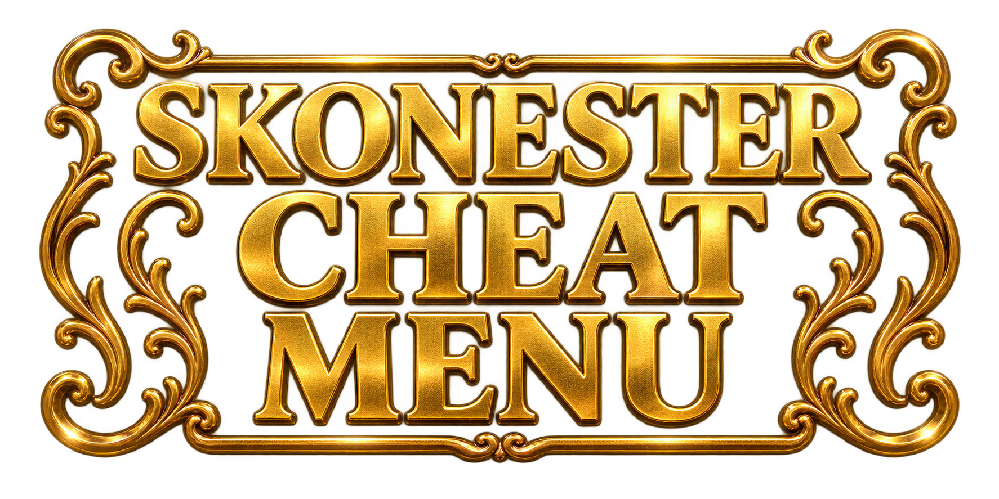

# Skonester Cheat Menu Gold

  

**Skonester Cheat Menu Gold** is a Crusader Kings III mod with character, realm, culture, faith, military, and artifact tools. It continues work from Daddy Pika's Cheat Menu and contributions by Zhuge and other CK3 modders. Most tools are available through character interactions or the Decisions menu.

## By God Alone release status

[Crusader Kings III: By God Alone](https://www.paradoxinteractive.com/games/crusader-kings-iii/add-ons/crusader-kings-iii-by-god-alone) is scheduled for **September 30, 2026**. This repository currently contains a **pre-release testing build** (`9.27.26-PreBGA`). Its `descriptor.mod` still declares support for CK3 `1.19.*` (Scribe). Compatibility with the By God Alone release and its accompanying game update has **not yet been verified**. Check the [Releases page](https://github.com/skonester/Skonester-Cheat-Menu/releases) for a build explicitly marked compatible after launch.

The repository checkout can be newer than the packaged releases. If you test this build around launch, please [report problems](#reporting-issues) with your exact game and mod versions.

## Install and open the menu

1. Download a packaged build from [Releases](https://github.com/skonester/Skonester-Cheat-Menu/releases), or use this repository checkout if you intend to test the development build. Check the release's stated CK3 version before installing.
2. Install it as a local CK3 mod through the Paradox Launcher. For a manual installation, place the mod contents in their own folder under `Documents/Paradox Interactive/Crusader Kings III/mod/` and register that folder with the launcher. The repository's `descriptor.mod` is the mod descriptor inside that folder; the launcher also needs a local mod entry.
3. Enable **Skonester Cheat Menu Gold** in your playset and start the game.
4. Right-click a character and select **Open Skonester Character Tools**. This reveals the character interaction tools and the custom editor windows. To show the decision-based menus, open **Decisions → Realm & Government Tools → Open Sub Menu Editor**.

Some options only appear for eligible characters, governments, or installed DLC. The debug action group requires CK3's debug mode. If a menu is missing, test with this mod alone first and include your load order in a report.

## What is included

| Area | Examples in this repository |
| --- | --- |
| Characters | Trait and lifestyle editors, character generation, age and relationship tools, character interactions, and cheat traits |
| Realm and economy | Gold, prestige, piety and renown controls; development and control decisions; titles, vassals, contracts, government and succession tools |
| Culture and faith | Culture and faith pickers and editors, traditions, innovations, and conversion tools |
| Armies and warfare | Army and men-at-arms spawning, military management, and warfare interactions |
| Artifacts and court | Artifact crafting and repair, court positions, and court management |
| Other tools | Domicile controls, legends, activities, and optional debug actions |

The menu is large, and individual actions have their own conditions. Use the in-game tooltips to see what a selected action will do.

## Repository layout

| Path | Purpose |
| --- | --- |
| `descriptor.mod` | Mod name, build version, and declared CK3 compatibility |
| `common/` | Decisions, interactions, traits, scripted effects and triggers, and other game definitions |
| `events/` | Event-driven menus and action flows |
| `gui/` and `gfx/` | Custom windows, interface layouts, icons, and art |
| `localization/` | Game text by language |
| `music/` and `dlc_metadata/` | Music and DLC metadata assets |
| `data_binding/` and `tools/` | Supporting bindings and development utilities |

Localization files are present for **English, German, Russian, Simplified Chinese, and Turkish**. Coverage varies by language and feature. To improve a translation, edit or add files under `localization/<language>/` and open a pull request. This checkout does not include an English consolidated localization file or the Python script referenced by `data_binding/rebuild_localization.bat`; edit the language files directly.

## Reporting issues

Please use [GitHub Issues](https://github.com/skonester/Skonester-Cheat-Menu/issues). Include:

- Your CK3 version, mod version or commit, and whether **By God Alone** is enabled.
- The action you used, the result you expected, and the result you saw.
- Steps to reproduce, your playset and load order, and whether it also happens with this mod alone.
- Relevant lines from `Documents/Paradox Interactive/Crusader Kings III/logs/error.log` for script errors or crashes.

Release notes and older builds are on the [Releases page](https://github.com/skonester/Skonester-Cheat-Menu/releases).

## Credits and license

This project builds on **Daddy Pika's Cheat Menu** by DaddyPika and contributions by **Zhuge**. Thanks also to Pavel, Bone, Leech, Sol, Xorxidox, Gravity, x4077, and other community contributors.

The repository is licensed under [Creative Commons Attribution 4.0 International](LICENSE). See [LICENSE](LICENSE) for the full text and attribution notice.
